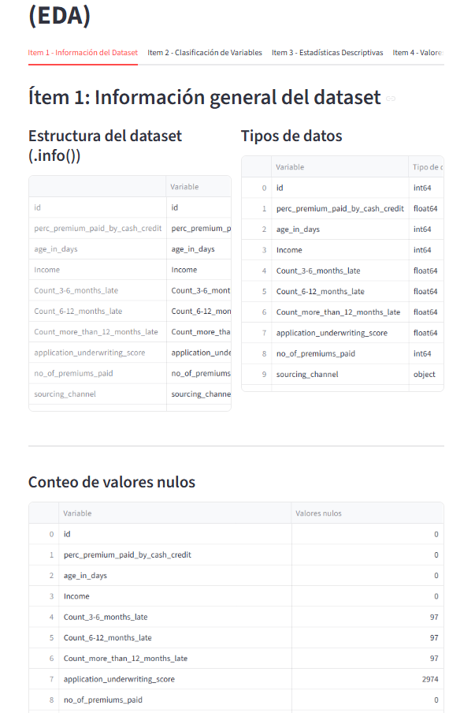
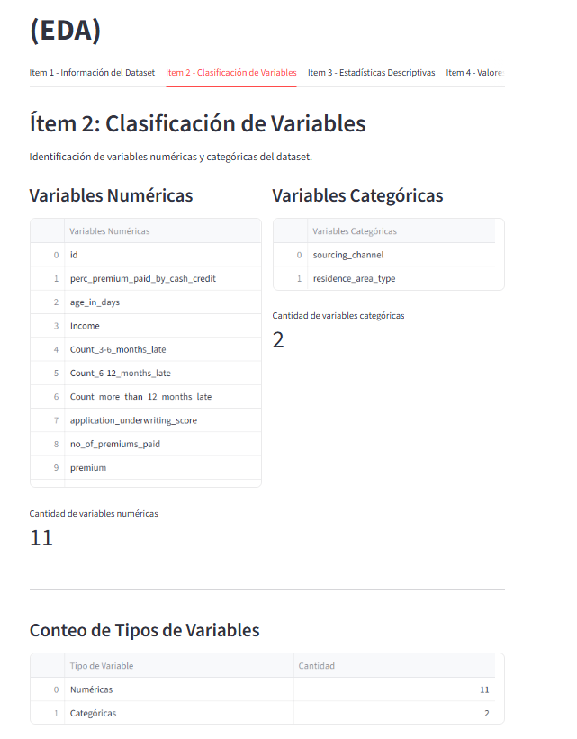
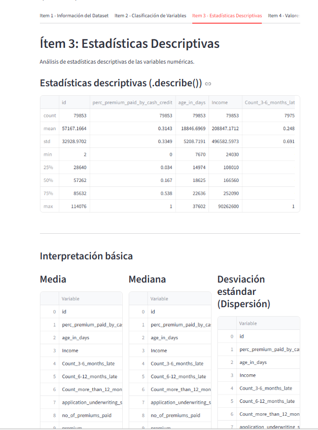
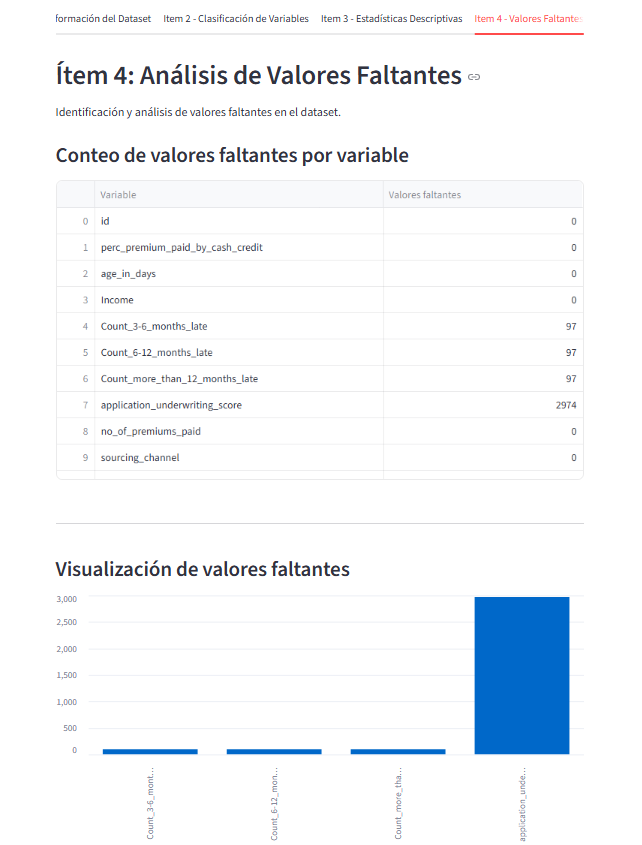
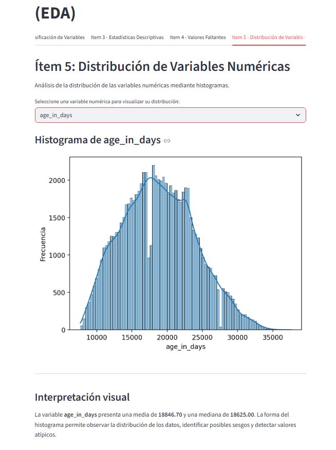
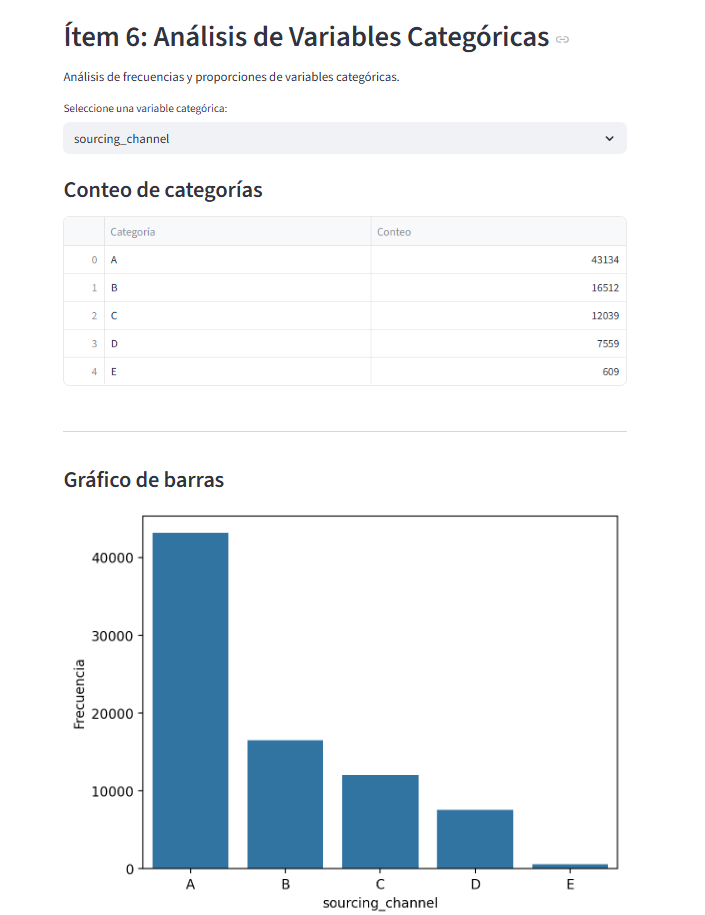
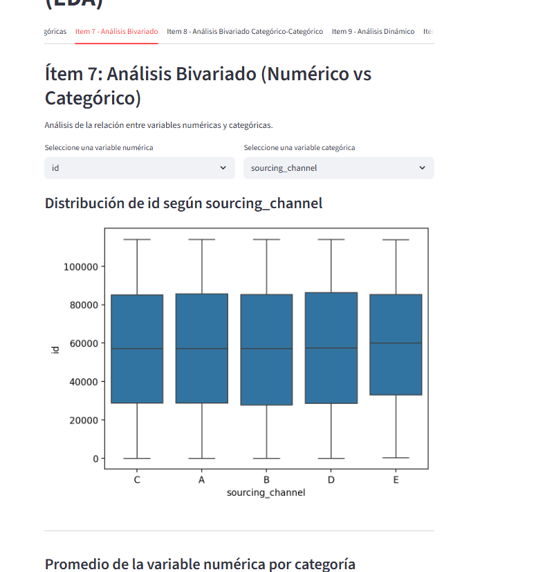
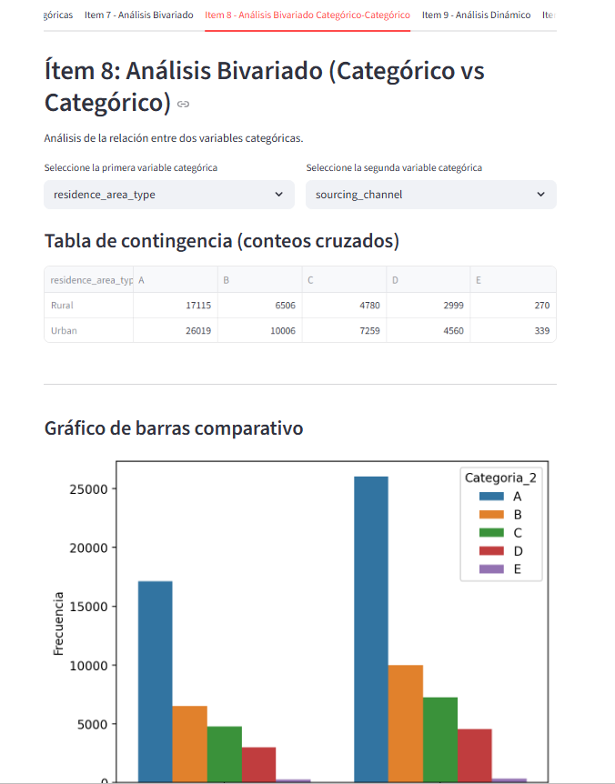
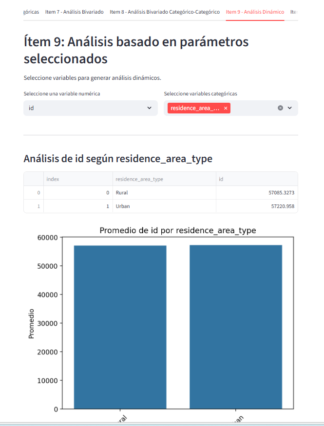
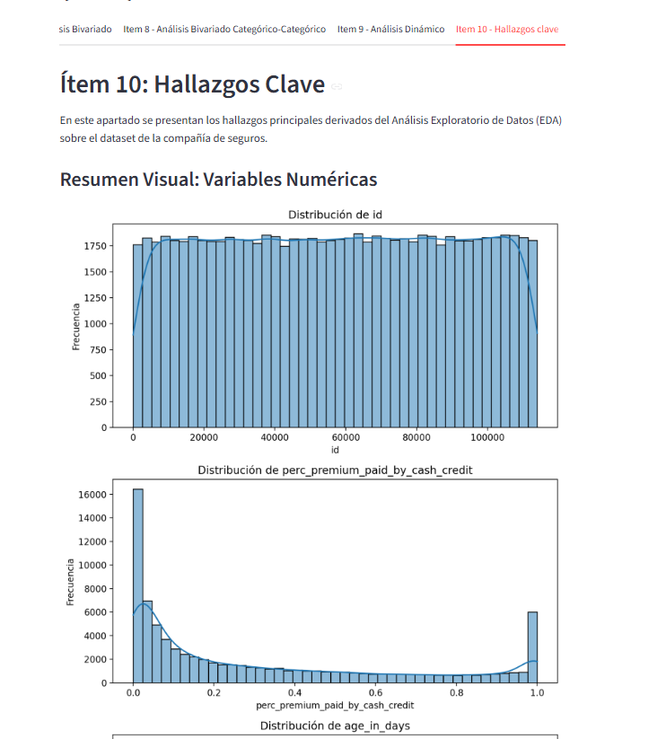

Descripción del Proyecto

Este proyecto es una app interactiva en Python creada con Streamlit para explorar datos de una compañía de seguros. La idea es que cualquier persona pueda analizar el dataset y entender cómo se comportan los clientes y qué patrones existen en la renovación de pólizas.

Con la app puedes:

Ver la estructura del dataset: cuántas filas, columnas y qué tipo de datos tiene cada variable.

Detectar valores faltantes: saber dónde faltan datos y cuántos hay, para decidir si los limpias o los imputas.

Explorar variables numéricas y categóricas: ver histogramas, gráficas de barras y proporciones de manera interactiva.

Hacer análisis bivariado: comparar cómo las variables numéricas cambian según categorías, o cómo se relacionan entre categorías.

Sacar insights: descubrir patrones importantes que pueden ayudar en decisiones o análisis predictivo.

La app está organizada en módulos y pestañas, así que navegar por los datos es fácil y visual. No necesitas ser un experto en programación para entender los resultados, pero sí tienes todas las herramientas técnicas necesarias para un análisis completo.


Capturas de pantalla de la app.













Instrucciones de Ejecución

1. Clonar el repositorio  
2. Instalar dependencias:

```
pip install -r requirements.txt